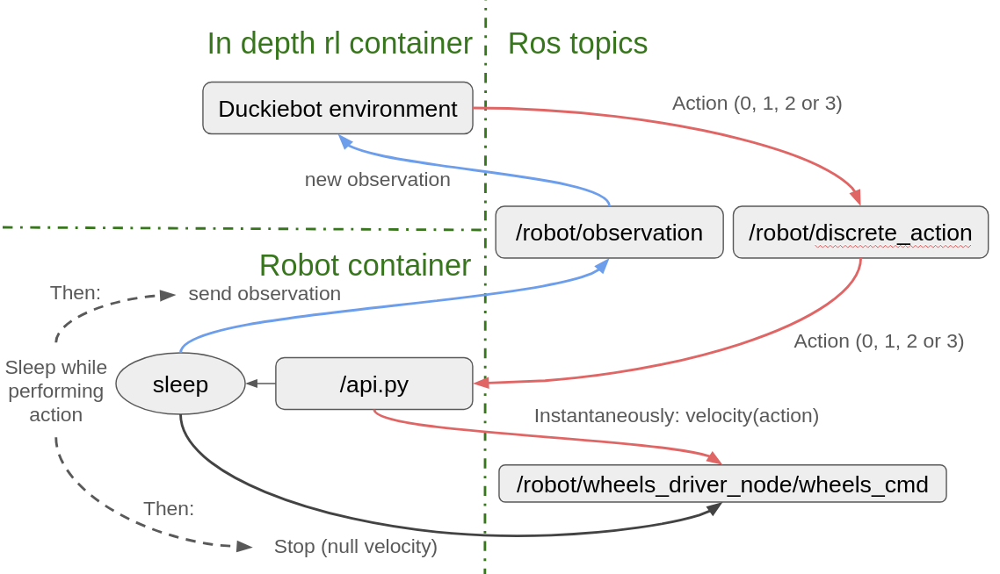

# Play with robots

## Installations

## Manipulate the robot

in /environments/real_world/ directory, you will find useful scripts to interact with the robot:
 - **duckie_bot_discrete.py** is probably the most important. 
It contains the discrete RL environment used to apply action on the real robot. 
Basically, this class is just an interface between your code, and the most basic ros topics.
 - On the robot, there is another api at /api.py. A copy of this script is in this directory at 
**/duckiereal/api.py**. It doesn't make sense to use this script in your container.
We put it here so you can see how it works, but you don't really need it.
This api basically receive actions as integers, and convert them into a velocity for each wheel.
After a specific time, it block the wheels and send the most recent observations to the environment.
 - **control_bot.py** allows you to control the bot with the keyboard. You can see it as an example of how to use the 
rl environment, or as a debugging tool.

## How does the RL-Environment interact with the robot?

This is a representation of how the container - robot setup work.
You don't necessarily need to know that because you're not supposed to modify it.
However, if you want to improve how the action are performed (this is YOUR challenge) then you might need to understand 
it.

